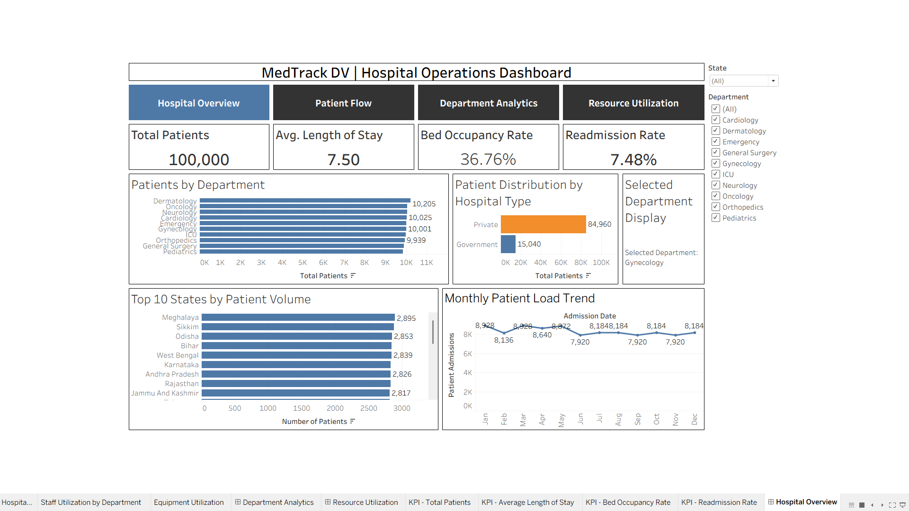
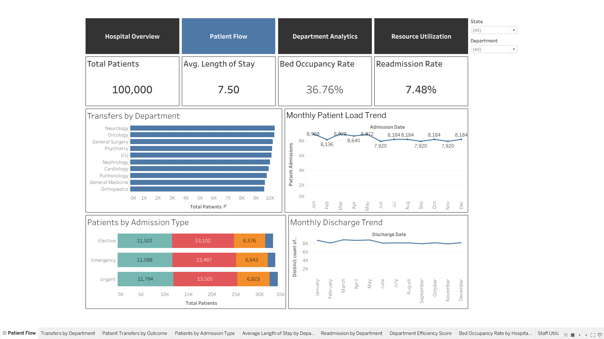
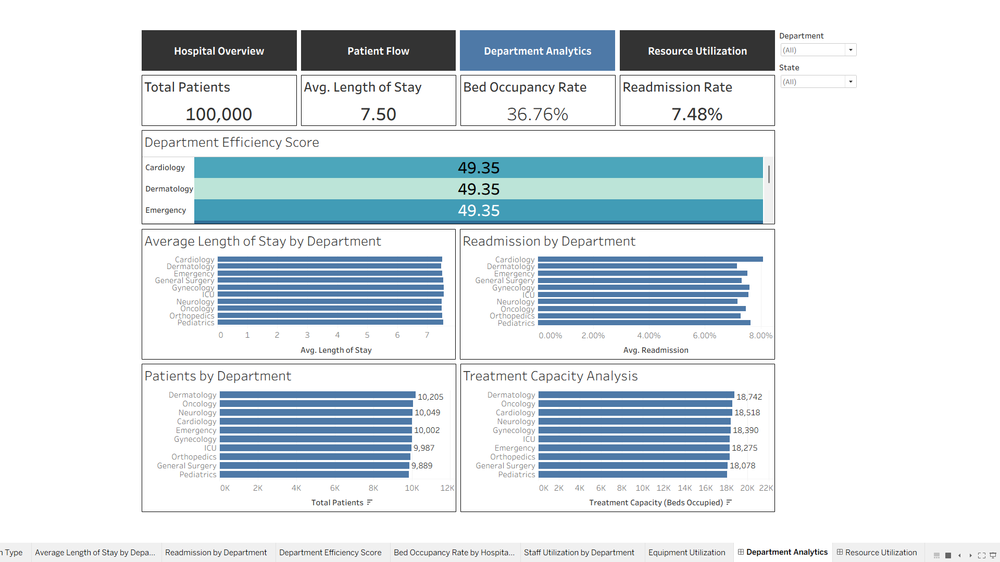
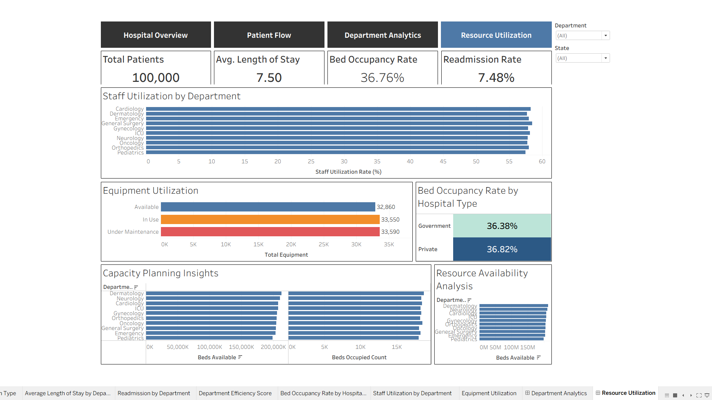

# MedTrack_DV — Hospital Operations & Patient Analytics Dashboard

> **Infosys Springboard Virtual Internship 7.0** · Data Visualization Project
> Python (Pandas, NumPy) + Tableau · 4 integrated dashboards · 7 KPIs

---

## Live Dashboard

**[View the interactive MedTrack_DV dashboard on Tableau Public](https://public.tableau.com/app/profile/alamanda.neelima/viz/MedTrack_DV_17907465161050/HospitalOverview)**

[](https://public.tableau.com/app/profile/alamanda.neelima/viz/MedTrack_DV_17907465161050/HospitalOverview)

---

## Project Overview

**MedTrack_DV** is a hospital operations and patient analytics project that turns hospital and patient admission data into a unified, interactive Tableau workbook.

The project covers hospital performance, patient admissions, patient flow, department efficiency, and healthcare resource utilization. The final deliverable is a single Tableau workbook (`.twbx`) with four interconnected dashboards:

1. Hospital Overview
2. Patient Flow
3. Department Analytics
4. Resource Utilization

> **Note:** This project uses publicly available datasets and is built for educational and portfolio purposes. See [Dataset Sources](#dataset-sources) for details.

---

## Dashboard Preview

### 1. Hospital Overview


### 2. Patient Flow


### 3. Department Analytics


### 4. Resource Utilization


---

## My Contribution

- Collected and integrated hospital datasets using Python
- Cleaned and transformed the data in a Jupyter notebook (Pandas)
- Engineered 7 healthcare KPIs in Python
- Planned, prototyped, and built all 4 Tableau dashboards
- Integrated global filters, navigation, and a parameter action
- Tested the workbook and documented the project

---

## Project Objectives

- Analyze hospital admissions and patient activity
- Monitor hospital performance using healthcare KPIs
- Analyze admission, discharge, movement, and stay patterns
- Compare department-level performance
- Analyze hospital resource utilization
- Provide interactive filters and dashboard navigation
- Integrate four related dashboards into a single workbook

---

## Project Workflow

```text
Hospital Data Collection
        ↓
Data Cleaning & Transformation
        ↓
KPI Engineering
        ↓
Dashboard Planning & Prototyping
        ↓
Dashboard Development
        ↓
Dashboard Integration
        ↓
Testing & Validation
        ↓
Documentation & Delivery
```

---

## Dataset Sources

| File | Location | Used For |
|---|---|---|
| Hospital Operation Dataset.csv | `data/raw_sources/` | Patient-level records (age, gender, department, diagnosis, doctor, insurance, readmission) |
| Hospitals_and_Beds_statewise.csv | `data/raw_sources/` | Number of hospitals and beds available per state |
| ICU beds count in India - Statewise.csv | `data/raw_sources/` | ICU beds per state |
| hospital_final_dataset(row_level).csv | `data/reference/` | Mentor-provided reference dataset for hospital-related columns |

### Data Integration Note

The public patient dataset has no State column and no usable dates. To demonstrate the end-to-end data integration workflow:

- States were randomly assigned to patient records from the hospital dataset (`random_state=42`).
- Admission and discharge dates were generated, and Length of Stay was recalculated from them.
- Doctor IDs were mapped to consistent doctor names.
- Hospital-related columns from the mentor reference dataset were repeated to match the patient dataset size.

Because of this, state-level and date-based trends in the dashboards are **illustrative, not real hospital statistics**.

---

## Milestone 1 — Data Collection & Preparation

### Module 1: Hospital Data Collection

Hospital, bed, ICU, and patient admission datasets were collected and merged into one raw dataset.

**Deliverables**

```text
data/neelima-hospital_raw_data.csv
scripts/neelima-data_collection.py
```

### Module 2: Data Cleaning & Transformation

The collected data was cleaned and transformed into a Tableau-ready dataset.

**Deliverables**

```text
data/neelima-hospital_cleaned.csv
notebooks/neelima-hospital_cleaning.ipynb
```

---

## Milestone 2 — KPI Engineering & Dashboard Planning

### Module 3: Hospital KPI Engineering

KPIs are calculated in Python and saved to the final Tableau-ready dataset.

**Deliverables**

```text
data/neelima-hospital_final_dataset.xlsx
scripts/neelima-generate_hospital_kpis.py
```

### Module 4: Dashboard Planning & Prototyping

Layouts, filters, navigation, dashboard actions, and department comparisons were planned for all four dashboards.

**Deliverables**

```text
dashboard/module4/
├── dashboard_storyboard.pdf
└── medtrack_prototype.twbx
```

---

## Milestone 3 — Dashboard Development

### Module 5: Hospital Overview & Patient Flow

**Hospital Overview**

- Admissions overview
- Hospital performance KPIs
- Occupancy monitoring
- Readmission analysis
- Monthly operational trends
- State-based and department-based analysis

**Patient Flow**

- Admission trends
- Discharge tracking
- Patient movement and transfer analysis
- Average stay analysis
- Peak patient-load monitoring

**Deliverable:** `dashboard/module5/medtrack_dashboard_v1.twbx`

### Module 6: Department Analytics & Resource Utilization

**Department Analytics**

- Department performance analysis
- Patient volume by department
- Readmission by department
- Department efficiency comparison
- Treatment capacity analysis

**Resource Utilization**

- Bed utilization analysis
- Staff utilization / allocation
- Equipment utilization tracking
- Capacity planning insights
- Resource availability analysis

**Dashboard Integration**

- Global State and Department filters
- Navigation controls between dashboards
- Department parameter action
- Dashboard linking

**Deliverable:** `dashboard/module6/MedTrack_DV.twbx`

---

## Dashboard Guide

```text
Hospital Overview
       │
       ├── Patient Flow
       ├── Department Analytics
       └── Resource Utilization
```

| Feature | What it does |
|---|---|
| State filter | Shows analysis for a selected state |
| Department filter | Focuses analysis on one department |
| Navigation controls | Move between the four dashboards |
| Parameter action | Passes a selected department into a Tableau parameter |

**How to view:**

- Online: open the [Tableau Public link](https://public.tableau.com/app/profile/alamanda.neelima/viz/MedTrack_DV_17907465161050/HospitalOverview)
- Offline: download `dashboard/module6/MedTrack_DV.twbx` and open it in Tableau Desktop or Tableau Public

---

## KPI Definitions

| KPI | Description |
|---|---|
| Total Admissions | Total number of admissions in the dataset |
| Occupancy Rate | Hospital occupancy based on patient and bed information |
| Average Length of Stay | Average duration of patient stay |
| Readmission Rate | Proportion of patients who were readmitted |
| Bed Utilization Rate | Utilization of available hospital beds |
| Department Efficiency Score | Department-level operational efficiency score |
| Staff Utilization Rate | Additional KPI for staff utilization |

Calculations: `scripts/neelima-generate_hospital_kpis.py`

---

## Healthcare Operations Methodology

1. **Data Collection** — Collected and integrated hospital and admission datasets
2. **Data Cleaning** — Standardized the data into a consistent structure
3. **KPI Engineering** — Calculated KPIs in Python
4. **Dashboard Planning** — Designed layouts, filters, and actions
5. **Dashboard Development** — Built four dashboards in Tableau
6. **Dashboard Integration** — Combined them with filters, navigation, and actions
7. **Testing & Validation** — Reviewed KPIs, filters, navigation, and interactions
8. **Documentation & Delivery** — Organized files and documentation

---

## Testing & Validation (Module 7)

```text
docs/testing/
├── QA_Checklist.pdf
└── Dashboard_Testing_Report.pdf
```

Testing covered KPI calculations, all four dashboards, global filters, navigation, parameter actions, patient-flow analytics, and integration. The final review identified no major dashboard functionality issues.

---

## Project Structure

```text
Hospital-Operations-Patient-Analytics-
│
├── README.md
│
├── data/
│   ├── neelima-hospital_raw_data.csv
│   ├── neelima-hospital_cleaned.csv
│   └── neelima-hospital_final_dataset.xlsx
│
├── dashboard/
│   ├── module4/
│   │   ├── dashboard_storyboard.pdf
│   │   └── medtrack_prototype.twbx
│   ├── module5/
│   │   └── medtrack_dashboard_v1.twbx
│   └── module6/
│       └── MedTrack_DV.twbx
│
├── docs/
│   ├── images/
│   │   ├── Hospital_Overview.png
│   │   ├── Patient_Flow.png
│   │   ├── Department_Analytics.png
│   │   └── Resource_Utilization.png
│   └── testing/
│       ├── QA_Checklist.pdf
│       └── Dashboard_Testing_Report.pdf
│
├── notebooks/
│   └── neelima-hospital_cleaning.ipynb
│
└── scripts/
    ├── neelima-data_collection.py
    └── neelima-generate_hospital_kpis.py
```

The `data/raw_sources/` and `data/reference/` folders hold working and reference files used during preparation and are not milestone deliverables.

---

## Tech Stack

| Area | Tools |
|---|---|
| Data Collection | Python |
| Data Processing & Cleaning | Pandas, NumPy, Jupyter Notebook |
| KPI Engineering | Python |
| Visualization | Tableau Desktop / Tableau Public |
| Interactivity | Filters, Parameters, Dashboard Actions |
| Version Control | Git, GitHub |
| Documentation | Markdown, PDF |

---

## Project Completion Status

| Milestone | Focus | Modules | Status |
|---|---|---|---|
| 1 | Data Collection & Preparation | 1–2 | Completed |
| 2 | KPI Engineering & Dashboard Planning | 3–4 | Completed |
| 3 | Dashboard Development | 5–6 | Completed |
| 4 | Testing, Documentation & Delivery | 7–8 | Completed |

---

## Links

- **Live dashboard:** [Tableau Public](https://public.tableau.com/app/profile/alamanda.neelima/viz/MedTrack_DV_17907465161050/HospitalOverview)
- **This repository:** https://github.com/neelima-alamanda/Hospital-Operations-Patient-Analytics-
- **Branch:** `neelima`
- **Final workbook:** `dashboard/module6/MedTrack_DV.twbx`
- **Original internship repository:** https://github.com/springboardmentor09876x-cmd/Hospital-Operations-Patient-Analytics-

---

## Author

**Neelima Alamanda** · [GitHub](https://github.com/neelima-alamanda) · [Tableau Public](https://public.tableau.com/app/profile/alamanda.neelima)